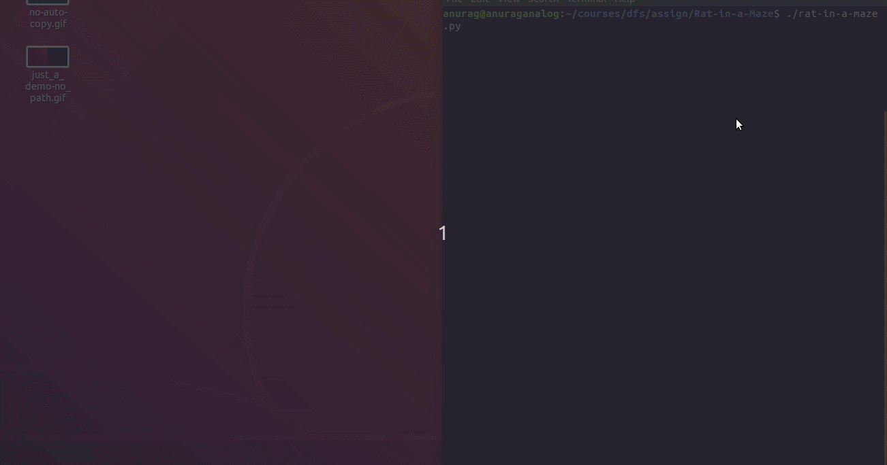
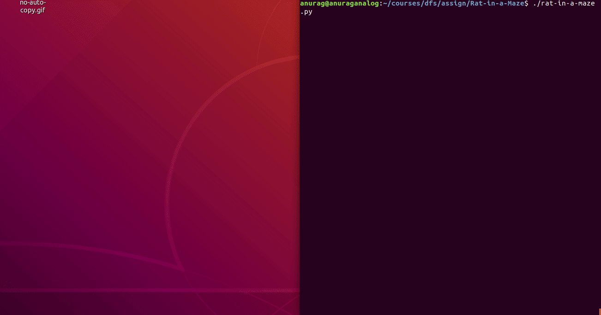

# Rat in a Maze

## Problem Statement

There will be a maze of size nxn, with walls at random position with random shape. The source will be at the top left, and the destination will be at the bottom right.
> Source and Destination Positions can be customized

The task is to find the cheese which is at the destination from the source.

**Priority**

right -> down -> left -> up

## Implementation
**Language Used:**
Python3

**Data-Structure Used:**
Stack(Linked list)
> In this, stack is implemented using list(append and pop)

**Traversal Method:**
Depth First Search(DFS)

**Modules Used**

* Time

* Numpy

* Termcolor

* **Gui Modules**

    * Tkinter

    * Pillow

## Setup

Before running the file, see that you have installed all the packages

    sudo pip3 install -r requirements.txt

and

    sudo apt install python3-tk

## Demo

**Found a Path**

**No Path**

## Miscellaneous

You can even change the colors of the maze; they are customizable

    ./colors.py

The above program, displays all the possible colors in tkinter.